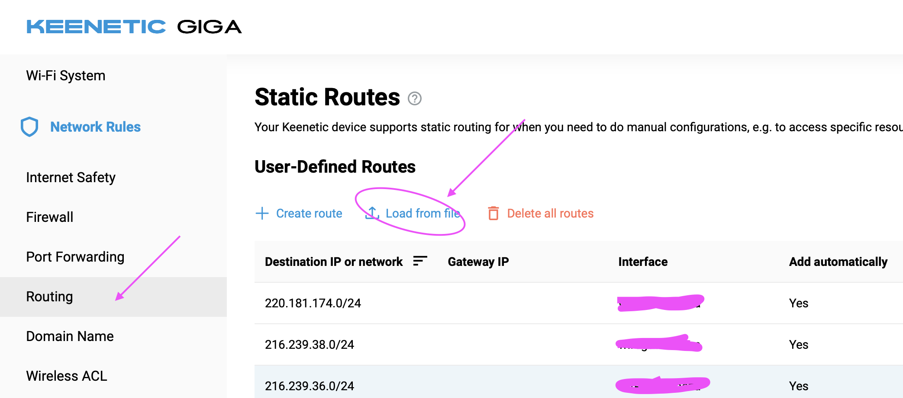

## keenetic antifilter routing

Автоматическая генерация правил роутинга для различных онлайн сервисов.
Используется для роутеров **keenetic**. Поддерживаемы сервисы:

- [youtube.com](routes/youtube-ipv4.bat)
- [instagram.com](routes/facebook-ipv4.bat)
- [chatgpt.com](routes/chatgpt-ipv4.bat)

Правила [обновляются](https://github.com/shlima/keneetic-antifilter/actions/workflows/generate.yml) автоматически раз в сутки (при наличии изменений).

## Как добавлять правила

Откройте раздел "Network rules" -> "Routing".
В разделе [Пользовательские статические маршруты](https://help.keenetic.com/hc/ru/articles/360000925780-Статические-маршруты) 
нажмите "Удалить все", затем загрузите нужный вам список из файла, выбрав необходимый сетевой интерфейс,
который будет использован для тунелирования целевого трафика. 

